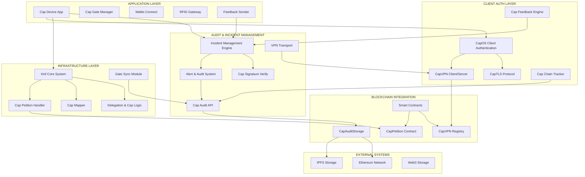
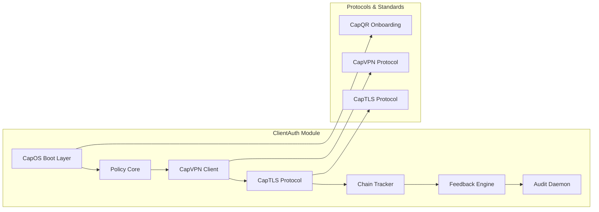
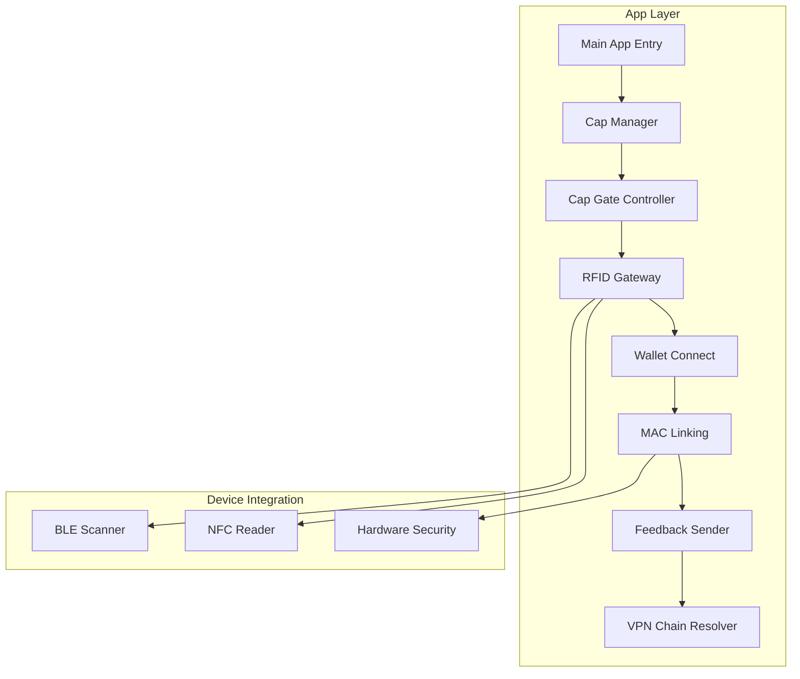
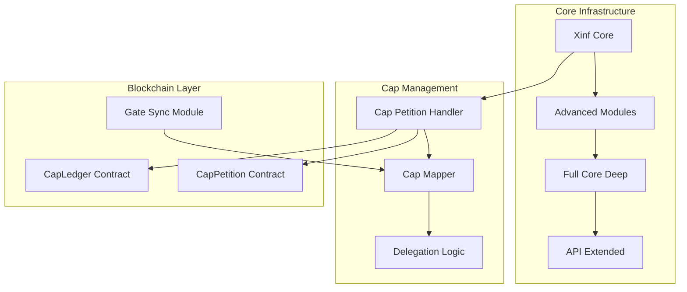
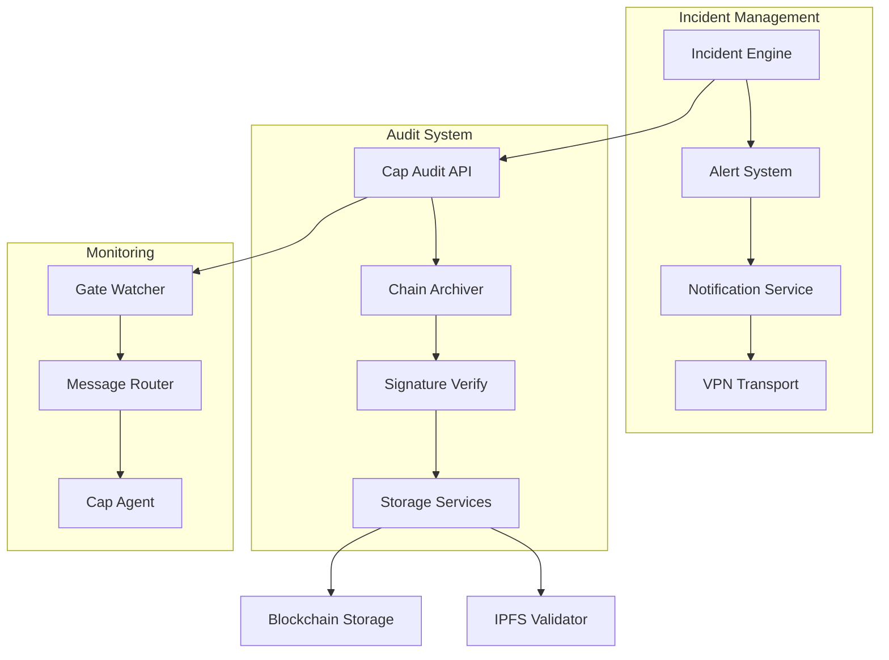

# X^∞ System Architekturdiagramm - code/

## Gesamtübersicht der Architektur

## Detailarchitektur nach Modulen

### 1. CLIENT AUTH (clientauth/)

**Zweck:** Authentifizierung, Autorisierung und sichere Kommunikation

**Kernkomponenten:**
- **CapOS Boot Layer:** Grundlegende Systeminitialisierung mit Cap-basierter Autorisierung
- **Policy Core:** Zentrale Richtlinienverwaltung für Cap-Berechtigungen
- **CapVPN:** Sichere VPN-Verbindungen mit Cap-Token-Authentifizierung
- **Chain Tracker:** Verfolgung und Validierung von Cap-Chain-Operationen
- **Feedback Engine:** Rückkopplungssystem für Systemzustände und Ereignisse

### 2. APPLICATION (app/)

**Zweck:** Benutzeroberfläche und Geräteverwaltung

**Kernkomponenten:**
- **Cap Manager:** Zentrale Verwaltung von Cap-Tokens und Berechtigungen
- **Cap Gate:** Kontrollpunkt für Zugangsberechtigungen
- **RFID Gateway:** Hardware-Integration für RFID-basierte Authentifizierung
- **Wallet Connect:** Blockchain-Wallet-Integration
- **Feedback Sender:** Übertragung von Rückkopplungsdaten an das System

### 3. INFRASTRUCTURE (infrastructure/)

**Zweck:** Kernlogik und Systeminfrastruktur

**Kernkomponenten:**
- **Xinf Core:** Hauptsystemlogik für das X^∞-Framework
- **Cap Petition Handler:** Verwaltung von Cap-Anfragen und -Genehmigungen
- **Delegation Logic:** Logik für die Delegierung von Berechtigungen
- **Gate Sync:** Synchronisation zwischen verschiedenen Gate-Knoten
- **Smart Contracts:** Blockchain-basierte Verträge für CapLedger und CapPetition

### 4. AUDIT & INCIDENT MANAGEMENT (a2a_IM/)

**Zweck:** Überwachung, Audit und Incident-Management

**Kernkomponenten:**
- **Incident Engine:** Zentrale Incident-Verwaltung und -Verarbeitung
- **Cap Audit API:** API für Audit-Operationen und -Abfragen
- **Chain Archiver:** Archivierung von Cap-Chain-Daten
- **Alert System:** Benachrichtigungssystem für kritische Ereignisse
- **Gate Watcher:** Überwachung von Gate-Knoten und -Aktivitäten

## Datenfluss und Interaktionen

### Hauptdatenströme:

1. **Authentifizierung:** 
   - App → ClientAuth → Infrastructure
   - Cap-Token-Validierung über Blockchain

2. **Audit-Trail:**
   - Alle Module → A2A_IM → Blockchain/IPFS
   - Kontinuierliche Rückverfolgbarkeit

3. **Rückkopplung:**
   - System-Events → Feedback Engine → Audit API
   - Realzeit-Monitoring und -Anpassung

4. **Gate-Synchronisation:**
   - Gate-Knoten ↔ Infrastructure ↔ Blockchain
   - Dezentrale Mesh-Architektur

## Sicherheitsarchitektur

### Mehrschichtige Sicherheit:
- **Ebene 1:** Hardware-basierte Authentifizierung (RFID/NFC)
- **Ebene 2:** Kryptographische Cap-Token-Validierung
- **Ebene 3:** Blockchain-basierte Unveränderlichkeit
- **Ebene 4:** Kontinuierliches Audit und Incident-Management

### Verteilte Verantwortung:
- Jede Komponente trägt Verantwortung für ihre Wirkungsebene
- Vollständige Rückverfolgbarkeit aller Aktionen
- Dezentrale Redundanz zur Manipulation-sabsicherung

## Technologie-Stack

- **Backend:** Python (Core Logic, APIs, Incident Management)
- **Frontend:** Dart/Flutter (Mobile App)
- **Blockchain:** Solidity (Smart Contracts), Ethereum
- **Storage:** IPFS (dezentrale Speicherung), Web3.Storage
- **Kommunikation:** VPN, TLS, BLE, NFC
- **Monitoring:** JSON-basierte Logs, signierte Audit-Trails

Diese Architektur implementiert die Kernprinzipien der X^∞-Philosophie der Verantwortung:
- **Rückverfolgbarkeit:** Jede Aktion ist dokumentiert und signiert
- **Dezentralität:** Verteilte Verantwortung ohne zentrale Schwachstellen
- **Realitätsbezug:** Messbare Wirkungen statt subjektive Interpretationen
- **Skalierbarkeit:** Modularer Aufbau für verschiedene Anwendungsbereiche# X^∞ System Architekturdiagramm - code/

## Gesamtübersicht der Architektur

## Detailarchitektur nach Modulen

### 1. CLIENT AUTH (clientauth/)

**Zweck:** Authentifizierung, Autorisierung und sichere Kommunikation

**Kernkomponenten:**
- **CapOS Boot Layer:** Grundlegende Systeminitialisierung mit Cap-basierter Autorisierung
- **Policy Core:** Zentrale Richtlinienverwaltung für Cap-Berechtigungen
- **CapVPN:** Sichere VPN-Verbindungen mit Cap-Token-Authentifizierung
- **Chain Tracker:** Verfolgung und Validierung von Cap-Chain-Operationen
- **Feedback Engine:** Rückkopplungssystem für Systemzustände und Ereignisse

### 2. APPLICATION (app/)

**Zweck:** Benutzeroberfläche und Geräteverwaltung

**Kernkomponenten:**
- **Cap Manager:** Zentrale Verwaltung von Cap-Tokens und Berechtigungen
- **Cap Gate:** Kontrollpunkt für Zugangsberechtigungen
- **RFID Gateway:** Hardware-Integration für RFID-basierte Authentifizierung
- **Wallet Connect:** Blockchain-Wallet-Integration
- **Feedback Sender:** Übertragung von Rückkopplungsdaten an das System

### 3. INFRASTRUCTURE (infrastructure/)

**Zweck:** Kernlogik und Systeminfrastruktur

**Kernkomponenten:**
- **Xinf Core:** Hauptsystemlogik für das X^∞-Framework
- **Cap Petition Handler:** Verwaltung von Cap-Anfragen und -Genehmigungen
- **Delegation Logic:** Logik für die Delegierung von Berechtigungen
- **Gate Sync:** Synchronisation zwischen verschiedenen Gate-Knoten
- **Smart Contracts:** Blockchain-basierte Verträge für CapLedger und CapPetition

### 4. AUDIT & INCIDENT MANAGEMENT (a2a_IM/)

**Zweck:** Überwachung, Audit und Incident-Management

**Kernkomponenten:**
- **Incident Engine:** Zentrale Incident-Verwaltung und -Verarbeitung
- **Cap Audit API:** API für Audit-Operationen und -Abfragen
- **Chain Archiver:** Archivierung von Cap-Chain-Daten
- **Alert System:** Benachrichtigungssystem für kritische Ereignisse
- **Gate Watcher:** Überwachung von Gate-Knoten und -Aktivitäten

## Datenfluss und Interaktionen

### Hauptdatenströme:

1. **Authentifizierung:** 
   - App → ClientAuth → Infrastructure
   - Cap-Token-Validierung über Blockchain

2. **Audit-Trail:**
   - Alle Module → A2A_IM → Blockchain/IPFS
   - Kontinuierliche Rückverfolgbarkeit

3. **Rückkopplung:**
   - System-Events → Feedback Engine → Audit API
   - Realzeit-Monitoring und -Anpassung

4. **Gate-Synchronisation:**
   - Gate-Knoten ↔ Infrastructure ↔ Blockchain
   - Dezentrale Mesh-Architektur

## Sicherheitsarchitektur

### Mehrschichtige Sicherheit:
- **Ebene 1:** Hardware-basierte Authentifizierung (RFID/NFC)
- **Ebene 2:** Kryptographische Cap-Token-Validierung
- **Ebene 3:** Blockchain-basierte Unveränderlichkeit
- **Ebene 4:** Kontinuierliches Audit und Incident-Management

### Verteilte Verantwortung:
- Jede Komponente trägt Verantwortung für ihre Wirkungsebene
- Vollständige Rückverfolgbarkeit aller Aktionen
- Dezentrale Redundanz zur Manipulation-sabsicherung

## Technologie-Stack

- **Backend:** Python (Core Logic, APIs, Incident Management)
- **Frontend:** Dart/Flutter (Mobile App)
- **Blockchain:** Solidity (Smart Contracts), Ethereum
- **Storage:** IPFS (dezentrale Speicherung), Web3.Storage
- **Kommunikation:** VPN, TLS, BLE, NFC
- **Monitoring:** JSON-basierte Logs, signierte Audit-Trails

Diese Architektur implementiert die Kernprinzipien der X^∞-Philosophie der Verantwortung:
- **Rückverfolgbarkeit:** Jede Aktion ist dokumentiert und signiert
- **Dezentralität:** Verteilte Verantwortung ohne zentrale Schwachstellen
- **Realitätsbezug:** Messbare Wirkungen statt subjektive Interpretationen
- **Skalierbarkeit:** Modularer Aufbau für verschiedene Anwendungsbereiche